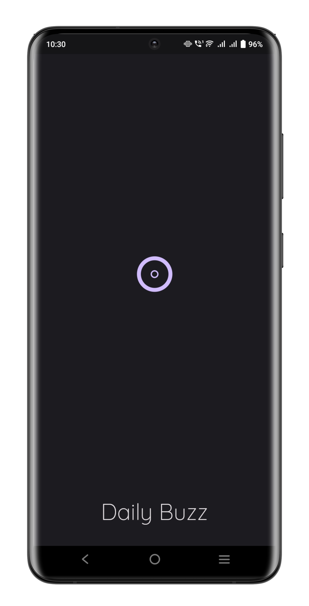
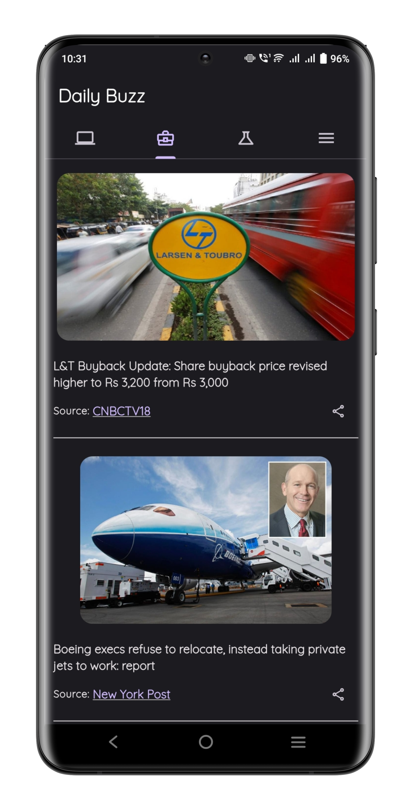
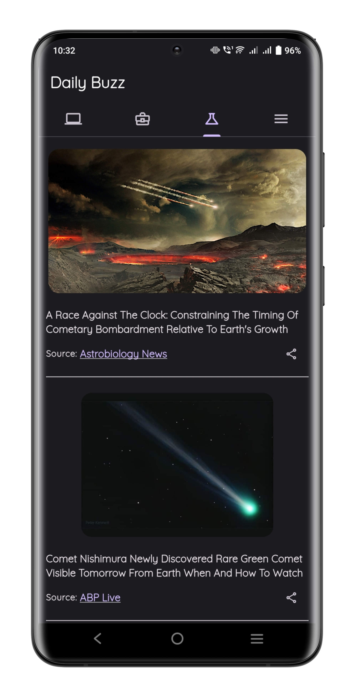
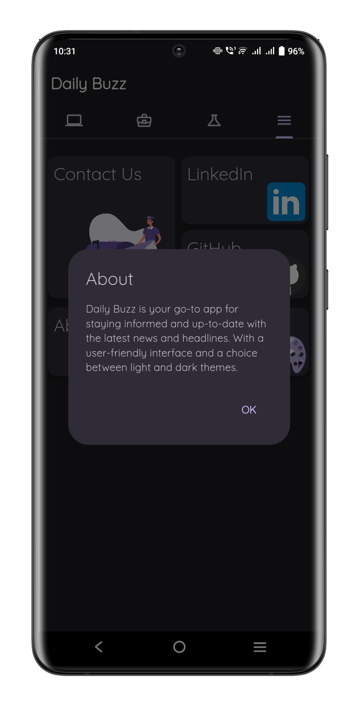
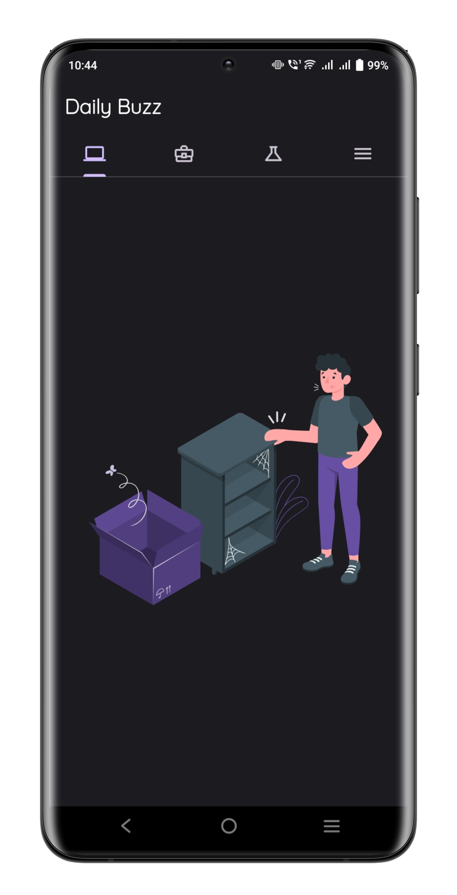
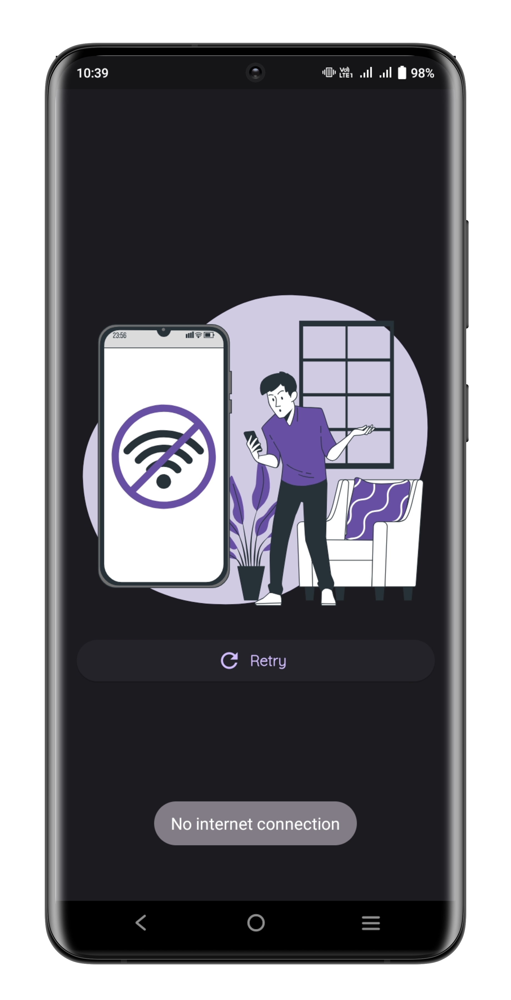
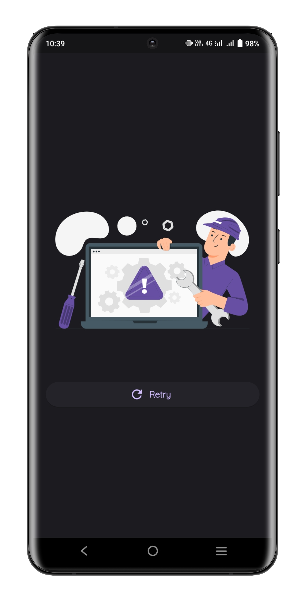

# Daily Buzz

Daily Buzz is a Flutter application designed to provide users with up-to-date news and articles from various categories such as technology, business, and science.

## Key Features
- Multi-category News
- Real-time Updates
- Curated Content
- User-Friendly Interface
- Share News
- Responsive Design
- Multi-Theme Support
- Feedback and Support

## Screenshots

## Getting Started
1. Clone this repository.
2. Make sure you have Flutter installed on your machine.
3. Navigate to the project directory and run `flutter pub get` to install dependencies.
4. Run the app using `flutter run`.

    ### OR

    To try out the app, you can download and install the APK file from the following link:
    [Download APK](https://drive.google.com/file/d/1CD1behXavh7kOw6JtUXhjXKlK6nt9N7G/view?usp=sharing)
    
    Make sure to enable installation from unknown sources on your device before installing the APK.
    
    Once the APK is installed, you can open the app and start using it.
